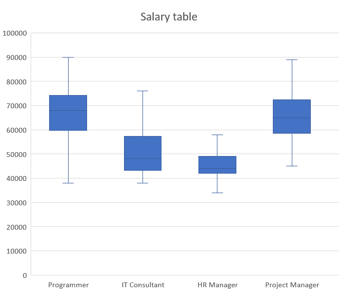
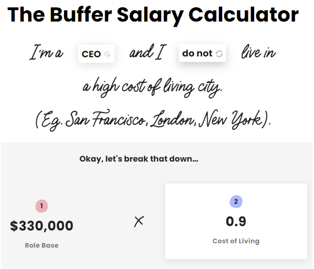
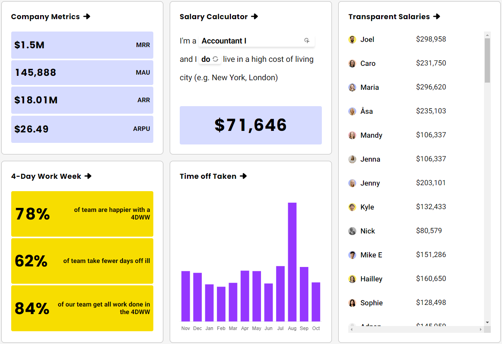
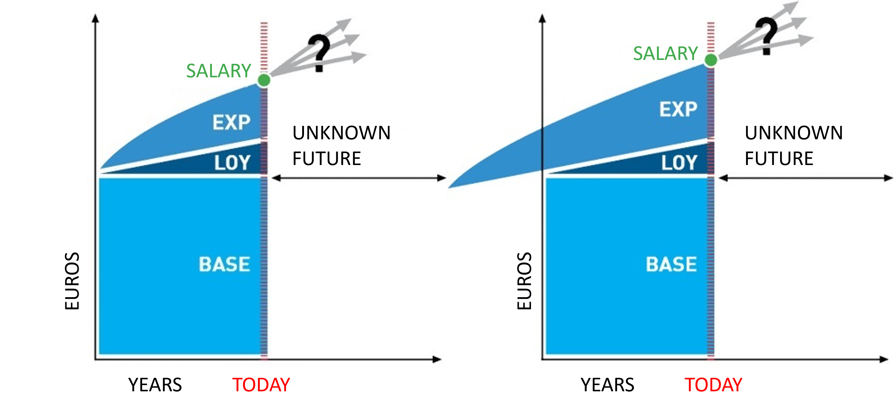
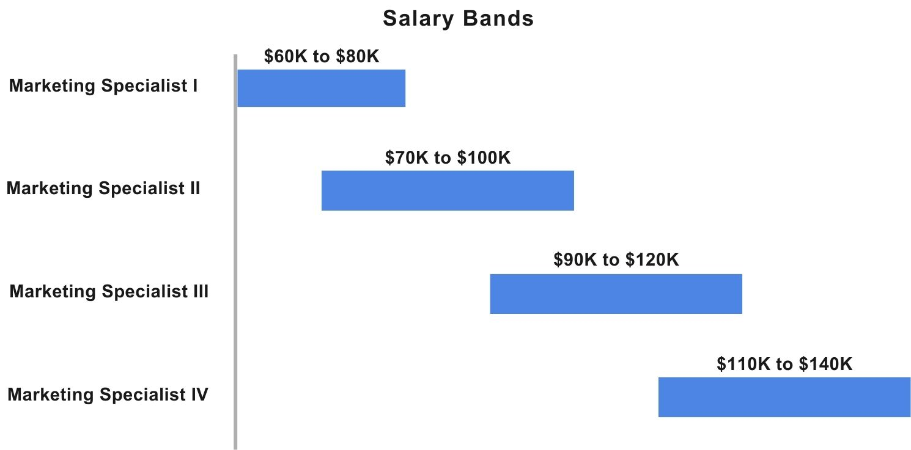

# Transparent Salary Systems
This will be an interesting blog of _Modern Salary Systems_ 
The [TL;DR](tldr.md) summarizes key points, but may omit detailed aspects found in the full article.

In today's world, where information flows freely and transparency is highly valued, the concept of transparent salary systems has gained significant attention. This presentation aims to shed light on what transparent salary systems are, why they are essential, and how organizations can implement them. Whether you're a student seeking to understand the world of work or an HR professional looking for ways to improve your organization's practices, this presentation will provide valuable insights. This blog will also highlight how innovative companies like Buffer and Sipgate are leading the way with their transparent salary practices.

# What

Transparent salary systems are compensation structures where employees have a clear understanding of how their pay is determined. It involves making salary-related information, such as pay scales, criteria for raises, and bonus structures, [accessible to employees](https://www.forbes.com/sites/sallypercy/2022/12/02/whats-so-great-about-pay-transparency/). Companies like Buffer use a public salary formula considering role, experience, and location, while Sipgate practices internal transparency within the company.

# Why
Here I will discuss why companies are creating Transparent Salary Systems. What are the purposes. The advantages and disadvantages.

1. **Pay Inequity:** Without transparency, employees may feel that they are unfairly compensated compared to their colleagues. Transparent systems help identify and rectify disparities, promoting fairness.

2. **Trust and Morale:** Openness about compensation fosters trust among employees. When workers understand how their pay is determined, they are more likely to feel valued, which can boost morale and engagement.

3. **Retention and Attraction:** Organizations with transparent salary systems often find it easier to retain talent and attract new hires. Candidates are more likely to choose companies where they can understand and trust the compensation structure.

| Pros | Cons |
|--- |--- |
| Ensures fair employee pay | Reducing candidate pools |
| Addresses pay discrepancies and inequities | Difficulty negotiating pay |
| Streamlines pay negotiations | Poaching of employees |
| Builds trust and retention | May cause employee discomfort, envy, and jealousy |
| Could lead to privacy concerns | May pressure management to overpay or increase salaries to match the market |
| Boost job satisfaction and productivity | Could complicate hiring by creating salary expectations among current staff |
| Providing a better candidate experience | Filters out candidates not within salary range, saving time and money |
| Increases accountability for equal compensation | |
| Attracting more talents | |

### Government regulations
Effective September 2023, [New York State](https://dol.ny.gov/pay-transparency-law-fare-grant#:~:text=Effective%209%2F17%2F2023%2C,the%20state%20of%20New%20York.) employers with 4 or more employees must include a salary or salary range in their job postings for all jobs to be performed, at least in part, in the state of New York.

---

# How

### Standardization
Companies should establish clear principles and guidelines. Salary formulae and tables can then be used to systematically determine pay. This ensures that the calculation is based on objective criteria and not subjective opinions.

### Communication
Communication of compensation strategies should be clear and empathetic. By openly sharing the rationale behind pay structures, companies can ensure that they attract and retain the right talent while also addressing any concerns the workforce may raise.

### Evaluation
It is crucial for companies to periodically review and assess the effectiveness of their compensation strategies. This involves looking back at what practices are working and which are not. After such assessments, companies should implement any necessary changes that could enhance the overall employee experience.

---

# Real-life Examples 
In the spirit of openness and equity, some innovative companies are making salary details public. This section shines a spotlight on firms like Buffer and Sipgate, whose transparent salary policies are charting a new course in workplace culture.

# Buffer

**Setting the Standard in San Francisco**

Based in San Francisco, Buffer is a social media management platform celebrated for its user-friendly interface and comprehensive services. They've earned acclaim for their radical transparency in tech, notably for publicly sharing salary information, which positions them as a leader in fair pay practices and attracts talent aligned with their values of openness and equality.

**Salary Transparency:** Buffer has made all of their salaries public, both internally and externally. This includes a detailed breakdown of how salaries are calculated.

**Salary Formula:** They use a formula to calculate pay, which factors in role, experience, and location. This formula is also made public.

**Salary Calculator:** Buffer provides a public salary calculator so that both current and prospective employees can see what they might earn.

**Public Equity:** Buffer shares information about equity and stock options, ensuring employees understand the value of their total compensation.

**Adjustment for Cost of Living:** Salaries at Buffer are adjusted based on the cost of living in an employee's location, which is part of their transparent formula.

**Educational Resources:** Buffer has blogged extensively about their transparent salary model, providing insights and resources for other companies interested in adopting similar practices.

---

# Sipgate

**Embracing Transparency in Düsseldorf**

Based in Düsseldorf, Germany, Sipgate, a telecommunications company, is recognized for its innovative VoIP solutions and commitment to egalitarian principles. By embracing salary transparency and openly discussing compensation, they've fostered an environment of trust and fairness, ensuring that employees feel valued while providing modern telecommunication services to individuals and businesses.

The salary graphs from sipgate, illustrate two different salary structures. The left graph shows the growth in salary for an employee who joined without professional experience, emphasizing increments for loyalty and gained experience. The right graph displays a higher starting salary for an individual with prior experience, acknowledging the value of their pre-existing expertise. Both diagrams highlight an "UNKNOWN FUTURE" segment, indicating the potential for future salary increases. Sipgate's transparent approach to compensation rewards personal development and loyalty, accommodating both novices and experienced professionals.

**Internal Salary Transparency:** Sipgate practices internal transparency with their salary system, allowing all employees to know what their colleagues are making.

**Participatory Budgeting:** They involve employees in budget discussions, including matters related to salaries, which promotes a sense of ownership and democracy.

**Regular Salary Reviews:** Sipgate regularly reviews salaries to ensure fairness and competitiveness, and these reviews are open for employees to contribute to.

**Salary Bands:** Sipgate utilizes clear pay bands for different roles, which are known internally to ensure everyone is aware of their potential growth.

**Equal Pay for Equal Work:** They are committed to the principle of equal pay for equal work, actively working to eliminate any gender or background pay gaps.

**Transparency in Progression:** Employees at Sipgate have clear paths for salary progression, which are made transparent to help with career planning.

---

# Conclusion
Transparent salary systems are more than just a trend; they represent a shift towards greater equity, trust, and clarity in the workplace. Companies like Buffer and Sipgate are leading examples of how transparency can positively transform organizational culture and employee relations.

---

# Key Takeaways
Key Takeaways

1. **Transparency is Key:** Transparent salary systems are crucial for addressing pay inequity, building trust, and attracting and retaining talent.

2. **Communication Matters:** Effective communication about the salary system is essential to ensure employees understand how their pay is determined.

3. **Continuous Improvement:** Transparent salary systems should be dynamic, evolving with the organization's needs and market conditions.

3. **No Blueprint:** Each company must define for itself what is most important to it.

# Sources

* Percy, S. (2022, December 2). What's so great about pay transparency? Forbes. Retrieved from https://www.forbes.com/sites/sallypercy/2022/12/02/whats-so-great-about-pay-transparency/

* Pay Transparency Law (FARE Grant). (o. D.). Department of Labor. https://dol.ny.gov/pay-transparency-law-fare-grant#:~:text=Effective%209%2F17%2F2023%2C,the%20state%20of%20New%20York.

* Jachimowicz, J. M., & Wihler, A. (2023). Research: The Unintended Consequences of Pay Transparency. Harvard Business School Working Paper, (23-039). Retrieved from https://www.hbs.edu/ris/Publication%20Files/23-039_f20d86a0-a1cf-4bd6-8066-74ccc6f2c3cf.pdf

* Zillman, C. (2018, August 15). How Salary Transparency Empowers Employees — and When Not to Use It. Time. Retrieved from https://time.com/5353848/salary-pay-transparency-work/

* Garden, C., & O’Toole, B. (2022, August). Research: The Unintended Consequences of Pay Transparency. Harvard Business Review. Retrieved from https://hbr.org/2022/08/research-the-unintended-consequences-of-pay-transparency

* Buffer. (n.d.). Open. Retrieved from https://buffer.com/open

* Buffer. (n.d.). Salary Calculator. Retrieved from https://buffer.com/salary-calculator

* Buffer. (n.d.). Salaries. Retrieved from https://buffer.com/salaries

* Sipgate. (n.d.). So zahlen wir. Medium. Retrieved from https://sipgate.medium.com/so-zahlen-wir-6251ec42205a

* Sipgate. (n.d.). Blog. Retrieved from https://www.sipgate.de/blog
