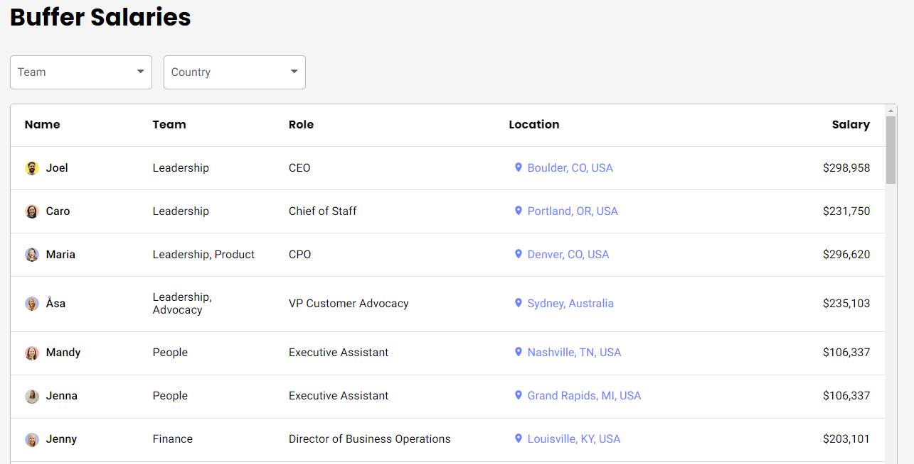

# Transparent Salary Systems

## What is it?
A transparent salary system refers to a compensation model where employees can openly view their [colleagues' salaries](https://www.forbes.com/sites/sallypercy/2022/12/02/whats-so-great-about-pay-transparency/).

## What are the advantages and disadvantages?

### The Positives

1. **Trust and Transparency**: With transparency, trust within the organization grows. Employees feel valued and understood, leading to [higher morale](https://www.hbs.edu/ris/Publication%20Files/23-039_f20d86a0-a1cf-4bd6-8066-74ccc6f2c3cf.pdf) and a better work environment.

2. **Reduced Gender and Ethnic Pay Gaps**: Transparent systems tend to reduce or eliminate discrepancies in pay based on gender or ethnicity, promoting a [fairer workplace](https://time.com/5353848/salary-pay-transparency-work/).

3. **Simplified Negotiations**: With clear pay scales, the often stressful process of salary negotiations is streamlined, as both employees and employers have a clear benchmark.

### The Negatives

1. **Potential for Jealousy and Resentment**: Transparency might lead to feelings of [jealousy among employees](https://hbr.org/2022/08/research-the-unintended-consequences-of-pay-transparency) who find out they earn less than their colleagues.

2. **Privacy Concerns**: Some employees may feel uncomfortable with their financial information being accessible to their peers.

3. **Overemphasis on Salary**: Transparency can sometimes shift the focus solely on compensation, detracting from other essential aspects of a job like growth opportunities and work-life balance.

Digital Organisation, Autmation & Technology: Coursework

## Who is doing it?

### Buffer

**Setting the Standard in San Francisco**

Based in San Francisco, Buffer is a social media management platform celebrated for its user-friendly interface and comprehensive services. They've earned acclaim for their radical transparency in tech, notably for publicly sharing salary information, which positions them as a leader in fair pay practices and attracts talent aligned with their values of openness and equality.

### Sipgate

**Embracing Transparency in Düsseldorf**

Based in Düsseldorf, Germany, Sipgate, a telecommunications company, is recognized for its innovative VoIP solutions and commitment to egalitarian principles. By embracing salary transparency and openly discussing compensation, they've fostered an environment of trust and fairness, ensuring that employees feel valued while providing modern telecommunication services to individuals and businesses.

## What are the Key Takaway

1. **Transparency is Key:** Transparent salary systems are crucial for addressing pay inequity, building trust, and attracting and retaining talent.

2. **Communication Matters:** Effective communication about the salary system is essential to ensure employees understand how their pay is determined.

3. **Continuous Improvement:** Transparent salary systems should be dynamic, evolving with the organization's needs and market conditions.

3. **No Blueprint:** Each company must define for itself what is most important to it.

## Sources and for more information:

[Forbes - The Rise of Salary Transparency](https://www.forbes.com/)

[Harvard Business Review - Transparency in Compensation: Trends and Best Practices](https://www.hbr.org/)

[PayScale - The Gender Pay Gap: Exploring the Evidence](https://www.payscale.com/)

[Business Insider - The Downsides of Transparent Salaries](https://www.businessinsider.com/)

[Society for Human Resource Management - Salary Transparency](https://www.shrm.org/)

[Buffer - Open for public](https://buffer.com/open)

[Sipgate - How do we pay](https://sipgate.medium.com/so-zahlen-wir-6251ec42205a)
